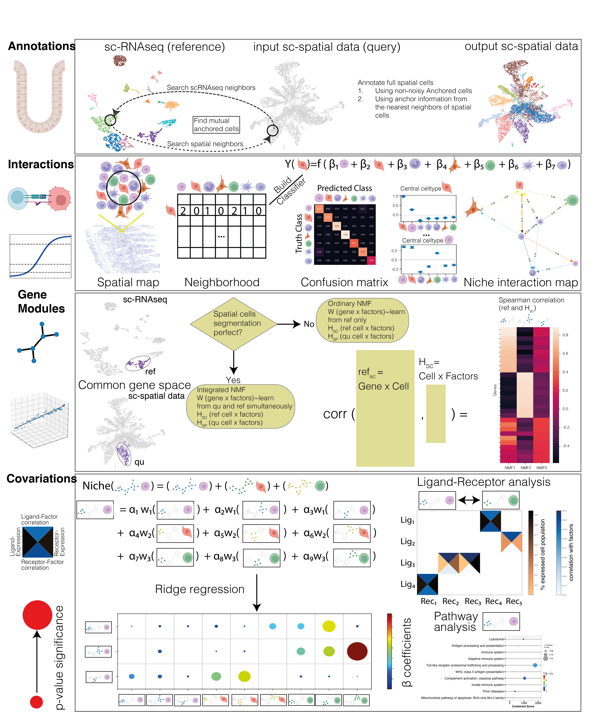

# NiCo Tutorial

<div align="center">



</div>

## Table of Contents

-   [NiCo](#nico)
    -   [Table of Contents](#table-of-contents)
    -   [Overview](#overview)
        -   [About Tutorial](#background)
    -   [Getting Started](#getting-started)
        -   [Prerequisites](#prerequisites)
        -   [Installation](#installation)
        -   [Data preparation](#preparation-NiCo)
        -   [Running NiCo](#running-NiCo)
    -   [Documentation](#documentation)
    -   [MERSCOPE data](#Vizgen-MERSCOPE-data)
    -   [Citing NiCo](#citing-nico)
    -   [Contact](#contact)

## Overview

We have developed the NiCo (Niche Covariation) package for the integration of single-cell resolution spatial transcriptomics and scRNA-seq data to (1) perform cell type annotations in the spatial modality by label transfer, (2) predict niche cell type interactions within local neighborhoods, and (3) infer cell state covariation and the underlying molecular crosstalk in the niche. NiCo infers factors capturing cell state variability in both modalities and identifies genes correlated to these latent factors for the prediction of ligand-receptor interactions and factor-associated pathways.

### About Tutorial
We are providing a tutorial on running the NiCo pipeline for the data integration of single-cell RNA sequencing (reference) and single-cell resolution of spatial transcriptomics data (query). This tutorial explains all steps of the NiCo pipeline, i.e., annotation of cell types in the spatial modality by label transfer from the scRNA-seq data, prediction of significant niche interactions, and derivation of cell state covariation within the local niche. 

Please keep all the files (NiCoLRdb.txt and *.ipynb) and folders (inputRef, inputQuery) in the same path to complete the tutorial. 

### Prerequisites

Please follow the information provided at [nico-sc-sp pip repository](https://pypi.org/project/nico-sc-sp/)


### Installation
For detailed instruction please follow the instructions at [nico-sc-sp pip repository](https://pypi.org/project/nico-sc-sp/)

``` console
conda create -n nicoUser python=3.11
conda activate nicoUser
pip install nico-sc-sp
```
Sometimes, the pygraphviz package cannot be installed via pip, or during the cell type interaction part it gives error that "neato" not found in path so an alternative conda way of installation is recommended. Please follow the installation of pygraphviz [here](https://pygraphviz.github.io/documentation/stable/install.html)


``` console
conda create -y -n nicoUser python=3.11
conda activate nicoUser
conda install -c conda-forge pygraphviz
pip install nico-sc-sp
pip install jupyterlab
```


### Data preparation

For data preparation, first extract all zip files and run the Juypter notebook Start_Data_preparation_for_niche_analysis.ipynb.
The newer version of Start_Data_prep_new.ipynb is available for updated version. 

### Running NiCo
After running this script and having generated normalised data files, run the Jupyter notebook Perform_spatial_analysis.ipynb (Perform_spatial_analysis_new.ipynb for newer version) to perform the core steps of NiCo.

By default, the tutorial generates all the figures both in the respective directory and inside the notebook. Please refer to the documentation for details on functions and parameters. 

## Documentation 

The detailed [documentation of NiCo](https://nico-sc-sp.readthedocs.io/en/latest/) modules and their usage functions can be seen in the given link. 

## Vizgen MERSCOPE data 
If you are working with Vizgen MERSCOPE spatial data, please process with "process_vizgenData.py" script to convert Vizgen data into gene_by_cell.csv and tissue_positions_list.csv files. 

## Cellbarcode name 
If you encounter any issues while running, please ensure that the cell barcode name is composed of characters rather than integer numbers. When pandas reads numeric values, it will read as int64 instead of object which create datatype confusion for other parts of the code. Therefore, please convert your cell barcode numbers to strings if they are purely numeric.

## Citing NiCo

-   Ankit Agrawal, Stefan Thomann, Dominic Grün. NiCo Identifies Extrinsic Drivers of Cell State Modulation by Niche Covariation Analysis.
    ***Submitted***, 2024

## Contact

> **_contact:_** If you face any problem during the tutorial or have any questions, please email me (ankitplusplus at gmail.com) or raise an issue on Git Hub. 


