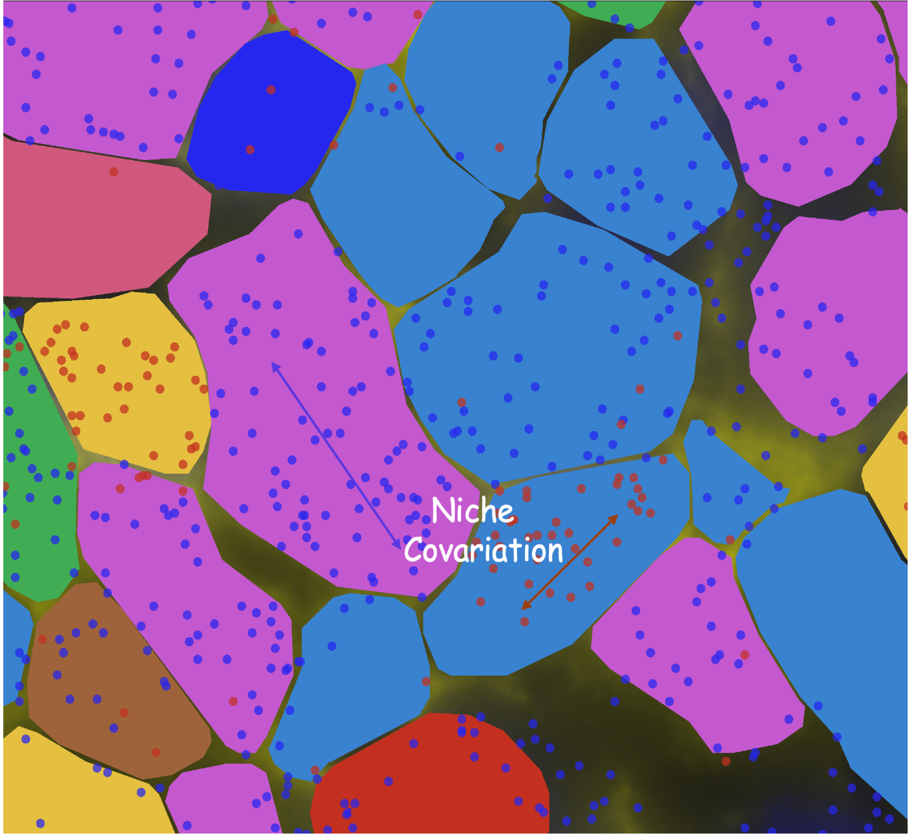

# README

<div align="center">

</div>


## NiCo Package [](https://doi.org/10.5281/zenodo.13902981)


<div align="center">


</div>

## Table of Contents

* [NiCo](./#NiCo)
  * [Table of Contents](./#table-of-contents)
  * [Overview](./#overview)
  * [Getting Started](./#getting-started)
    * [About the Tutorial](./#background)
    * [Prerequisites](./#prerequisites)
    * [Installation](./#installation)
  * [Notes and Warnings](./#Font)
  * [Documentation](./#documentation)
  * [Citing NiCo](./#citing-nico)
  * [Contact](./#contact)

## Overview

For a better presentation of this page, you can also visit [Gitbook](https://ankitbioinfo.gitbook.io/nico-tutorial).

We have developed the NiCo (Niche Covariation) package for the integration of single-cell resolution spatial transcriptomics and scRNA-seq data. NiCo allows you to:

(1) Perform cell type annotations in the spatial modality by label transfer.\
(2) Predict niche cell type interactions within local niche neighborhoods.\
(3) Infer cell state covariation and the underlying molecular crosstalk in the niche.

NiCo infers factors capturing cell state variability in both modalities and identifies genes correlated to these latent factors to predict ligand-receptor interactions and factor-associated pathways.

## Tutorial

NiCo can be used on data generated by any spatial transcriptomics method, but it is mainly designed for single-cell resolution spatial technologies such as MERFISH, seqFISH, Xenium etc.

We are providing a **first tutorial** on running the NiCo pipeline for the data integration of single-cell RNA-sequencing (reference) and single-cell resolution spatial transcriptomics data (query).

The **second NiCo tutorial** showcases an application to low-resoution genome-wide sequencing-based spatial transcriptomics data where integration with single-cell RNA-sequencing data is not required.

Please use the tutorial link below and keep all the files (NiCoLRdb.txt and \*.ipynb) and folders (inputRef, inputQuery; after unzipping) in the same path to complete the tutorial.

### Tutorial 1: High-resolution spatial technologies (seqFISH, MERFISH or MERSCOPE, and Xenium)

* **Part A: Data Preparation** Extract all zip files and run the Juypter notebook [`Start_Data_prep.ipynb`](Start\_Data\_prep.ipynb) to create the data files for NiCo analysis.
* **Part B: Running NiCo on selected cell types** After data preparation and generating normalised data files, run the Jupyter notebook [`nico_analysis_highres_image_tech.ipynb`](nico\_analysis\_highres\_image\_tech.ipynb) to perform the core steps of NiCo.\
  This tutorial explains all steps of the NiCo pipeline, including annotation of cell types in the spatial modality by label transfer from the scRNA-seq data, prediction of significant cell type niche interactions, and derivation of cell state covariation within the local niche.\
  By default, the figures generated are saved both in the respective directory and inside the notebook.\
  Please refer to the documentation for details on functions and parameters.\
  The data source is provided in the manuscript.
* **Part B: Running NiCo on all cell types** If users want to perform NiCo analysis on the full data without specifying any cell type, refer to the script. [`nico_analysis_highres_image_tech.py`](nico\_analysis\_highres\_image\_tech.py). The output log can be seen [here](log\_output.txt). Due to large number of images, a Jupyter notebook might not display them properly. However, leaving the `choose_celltypes` and `choose_factors_id` lists blank will enable the full analysis.

### Tutorial 2: Sequencing-based spatial technologies (Slide-seqV2)

Run NiCo on cerebellum data from Slide-seqV2 technology \[data from Cable, D. M. et al. Nature methods 19, 1076–1087 (2022)].


* Download the data from [this link](https://www.dropbox.com/scl/fi/6hxyp2pxpxalw9rfirby6/nico\_cerebellum.zip?rlkey=9ye6rsk92uj9648ogjw5ypcum\&st=lvc8e366\&dl=0) and place the data in the following path to complete the tutorial: `nico_cerebellum/cerebellum.h5ad` 
* The NiCo niche detection and covariation analysis tasks can be run via following the jupyter notebook [`nico_analysis_lowres_seq_tech.ipynb`](nico\_analysis\_lowres\_seq\_tech.ipynb)

## Notes on Data Preparation

Sometimes, computing Pearson residuals in the shared gene space for scRNA-seq data can result in NaN values. In such cases, it's recommended to apply filter_cells after aligning to the shared gene space to remove problematic cells. This helps ensure that downstream analyses are not affected by cells with zero counts or low-quality measurements.

General 
```
ad_seq_common=ad_seq_ori[:,index_sc].copy()
ad_seq_common.raw=ad_seq_common.copy()
sc.experimental.pp.normalize_pearson_residuals(ad_seq_common,inplace=True)
ad_seq_common.write_h5ad(scdatapath+'sct_singleCell.h5ad')
```

In special case when NaN value arises. 
```
ad_seq_common=ad_seq_ori[:,index_sc].copy()
sc.pp.filter_cells(ad_seq_common, min_counts=5)
ad_seq_common.raw=ad_seq_common.copy()
sc.experimental.pp.normalize_pearson_residuals(ad_seq_common,inplace=True)
ad_seq_common.write_h5ad(scdatapath+'sct_singleCell.h5ad')
```


## Prerequisites

Please follow the instructions provided in the [nico-sc-sp pip repository](https://pypi.org/project/nico-sc-sp/) for set up and installation.

## Installation

Tested NiCo 1.5.0 in following configuration 
```
MacOS Sequoia with Apple M4 Max Chip 
MacOS Sonoma with Intel graphics 
Ubuntu OS 24.10 Oracular  
```


For detailed instruction, visit the [nico-sc-sp pip repository](https://pypi.org/project/nico-sc-sp/)

```console
conda create -n nicoUser python=3.11
conda activate nicoUser
pip install nico-sc-sp
```

Sometimes, the pygraphviz package cannot be installed via pip, or during the cell type interaction part it returns an error that "neato" is not found in the path, so an alternative installation via conda is recommended. Please follow the installation of pygraphviz [here](https://pygraphviz.github.io/documentation/stable/install.html)

```console
conda create -y -n nicoUser python=3.11
conda activate nicoUser
conda install -c conda-forge pygraphviz
pip install nico-sc-sp
pip install jupyterlab
```
#### 🔄 Changes in version 1.6.0 (from 1.5.0)

### 1. New Inputs and Parameters
- Added **filename variables** as inputs in  
  `find_anchor_cells_between_ref_and_query()`  
  (input now supports *brainfo*).

### 2. Bug Fixes
- Resolved a bug in the following functions  
  *(Thanks to **Andy Shing Fung Chan** for the modification!)*:
  - `visualize_umap_and_cell_coordinates_with_selected_celltypes`
  - `plot_top_genes_for_a_given_celltype_from_all_factors`

### 3. Added Organism Support ("Mouse" and "Human")
The following functions now include an **organism** parameter.  
Previously, `rps_rpl_mt_genes_included` only supported *Mouse*.

- `rps_rpl_mt_genes_included=True`,  
  **organism = "Mouse"** or **organism = "Human"**
- `plot_top_genes_for_pair_of_celltypes_from_two_chosen_factors(organism='Mouse')` *(new)*
- `pathway_analysis`
- `extract_and_plot_top_genes_from_chosen_factor_in_celltype`
- `plot_top_genes_for_a_given_celltype_from_all_factors`

### 4. Separate Cutoff Variables for Ligand and Receptor
Added independent cutoff variables for ligand and receptor expression and factor thresholds:

- `Ligand_proportion_of_cells_expressed_thres`
- `Receptor_proportion_of_cells_expressed_thres`
- `Ligand_Factor_thres`
- `Receptor_Factor_thres`

These updates apply to:
- `find_LR_interactions_in_interacting_cell_types`
- `save_LR_interactions_in_excelsheet_and_regression_summary_in_textfile_for_interacting_cell_types`

### 5. New Visualization Functions
- **`visualization_of_colocalized_celltype_factors_as_scatterplot`**  
  Scatter plot of central and neighboring cell factors when both are colocalized.

- **`visualization_of_colocalized_celltype_factors_as_bar_violin_plot`**  
  Visualizes the average factor importance when two cell types are colocalized vs. non-colocalized.

- **`visualization_of_top_celltype_proximity_pairs`**  
  Displays top enriched colocalized cell-type pairs (observed vs. expected).


#### 🔄 Changes in version 1.5.0 (from 1.4.0)

- ✅ **MacBook Silicon (Apple M-series) support:**  
  The package has now been tested and confirmed to work on Apple Silicon machines.

- 🎨 **Centered colormap at 0** in `plot_significant_regression_covariations_as_circleplot`  
  for better interpretability of regression results.  
  *Thanks to Andy Shing Fung Chan for the modification!*


## Notes and Warnings


### Error in any other system 
Some error was reported in few cases (not every case can be tested) during the installation of pygraphviz package along with NiCo. So that complete installation was not possible. 
```
  note: This error originates from a subprocess, and is likely not a problem with pip.
  ERROR: Failed building wheel for pygraphviz
  Running setup.py clean for pygraphviz
Failed to build pygraphviz
ERROR: Failed to build installable wheels for some pyproject.toml based projects (pygraphviz)
```

In such cases please download the scripts and utils from [here](https://github.com/ankitbioinfo/nico_tutorial/tree/main/NiCo) and placed in your current directory. And from python prompt load the module in following way  
```
import Annotations as sann
import Interactions as sint
import Covariations as scov
```


#### Function Parameters 

To check the usage of any function you can execute the command as in the example:. <br>[```<moduleName>.<functionName>.__doc__```]
```print(scov.save_LR_interactions_in_excelsheet_and_regression_summary_in_textfile_for_interacting_cell_types.__doc__)```

#### Font

If at any step returns the warning `findfont: Font family 'Helvetica' not found` please initialize the matplotlibrc file to use a different font:

```
import matplotlib.pyplot as plt
plt.rcParams['font.family'] = 'sans-serif'
plt.rcParams['font.sans-serif'] = ['Tahoma', 'DejaVu Sans','Lucida Grande', 'Verdana']
```

#### Vizgen MERSCOPE data

If you are working with Vizgen MERSCOPE spatial data, please process the output with the "process\_vizgenData.py" script to convert Vizgen data into gene\_by\_cell.csv and tissue\_positions\_list.csv files.

#### Cellbarcode name

If you encounter any issues while running, please ensure that the cell barcode name is composed of characters rather than integer numbers. When pandas reads numeric values, it will read as int64 instead of objects which creates datatype confusion in other parts of the code. Therefore, please convert your cell barcode numbers to strings if they are purely numeric.

## Talk 
I presented a talk on the NiCo algorithm at BPPB seminar. If you're curious to learn more in detail, you can check it out here!.
[Talk about NiCo](https://www.youtube.com/watch?v=cfJm4jiMNRU&ab_channel=BPPBSeminar)

## Documentation

For detailed documentation of NiCo modules and their usage, visit [NiCo documentation](https://nico-sc-sp.readthedocs.io/en/latest/).

## Citing NiCo

If you use NiCo in your research, please cite it as follows:

* Ankit Agrawal, Stefan Thomann, Sukanya Basu, Dominic Grün. NiCo Identifies Extrinsic Drivers of Cell State Modulation by Niche Covariation Analysis. _**Nature Communications**_, 2024
  [Article link](https://www.nature.com/articles/s41467-024-54973-w)

## Contact

> _**contact:**_ If you face any problem during the tutorial or have any questions, please email me (ankitplusplus at gmail.com) or raise an issue on GitHub.

### License

[MIT License](LICENSE/)
